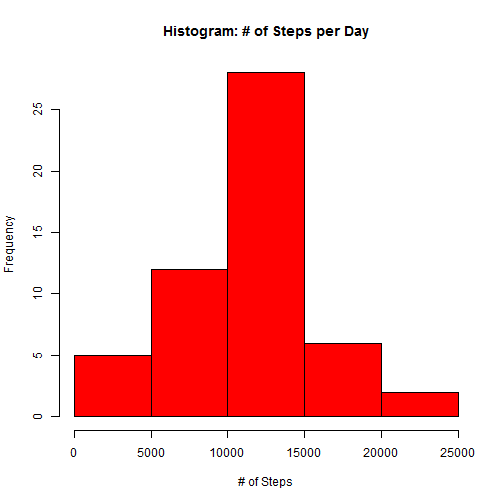
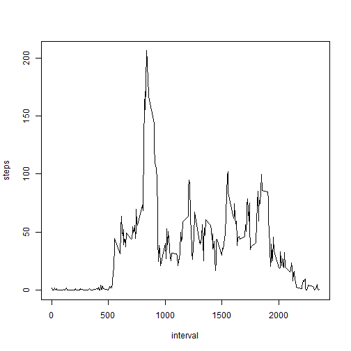
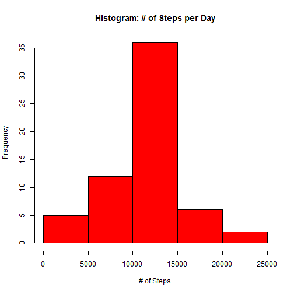
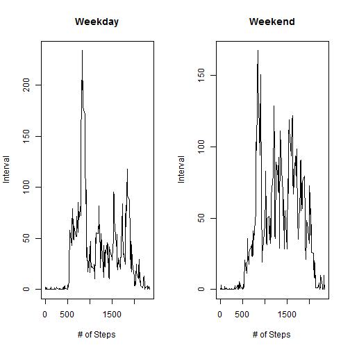

<h1>What is mean total number of steps taken per day?</h1>
<p>1: Calculate the total number of steps taken per day</p>


```r
  ## Load the SQLDF library for easier filtering of the text file
  library("sqldf")
  
  ## Load and Remove NA values
  data <- read.csv("activity.csv")
  data <- na.omit(data)
  
  ## Set Numeric Steps Value
  data$steps <- as.numeric(as.character(data$steps))
  
  ## Aggregate Daily Steps
  data1 <- aggregate(steps ~ date, data, sum)
  
  ## Output Daily Step Totals Sample
  head(data1)
```

```
##         date steps
## 1 2012-10-02   126
## 2 2012-10-03 11352
## 3 2012-10-04 12116
## 4 2012-10-05 13294
## 5 2012-10-06 15420
## 6 2012-10-07 11015
```

<p>2: If you do not understand the difference between a histogram and a barplot, research the difference between them. Make a histogram of the total number of steps taken each day</p>


```r
  ## Histogram plot
  hist(data1[,2], col = "red", main = "Histogram: # of Steps per Day", xlab = "# of Steps")
```

 

<p>3: Calculate and report the mean and median of the total number of steps taken per day</p>


```r
  ## Mean / Average
  mean(data1$steps)
```

```
## [1] 10766.19
```

```r
  ## Median
  median(data1$steps)
```

```
## [1] 10765
```


<h1>What is the average daily activity pattern?</h1>

<p>1: Make a time series plot (i.e. type = "l") of the 5-minute interval (x-axis) and the average number of steps taken, averaged across all days (y-axis)</p>


```r
  ## Aggregate avg steps by interval
  data1 <- aggregate(steps ~ interval, data, mean)
  
  ## Time series of # of steps per 5 minute testing interval
  plot(steps ~ interval, data1, type = "l")
```

 

<p>2: Which 5-minute interval, on average across all the days in the dataset, contains the maximum number of steps?</p>


```r
  ## Time Interval with maxium number of steps on average
  head(data1[with(data1, order(-steps)), ],1)
```

```
##     interval    steps
## 104      835 206.1698
```

<h1>Imputing missing values</h1>

<p>1: Calculate and report the total number of missing values in the dataset (i.e. the total number of rows with NAs)</p>


```r
  ## Find NA values
  data2 <- read.csv.sql("activity.csv", sql = "select * from file where steps = 'NA' ", sep = ",", eol="\n")
  
  ## Num of NA Rows
  nrow(data2)
```

```
## [1] 2304
```

<p>2: Devise a strategy for filling in all of the missing values in the dataset. The strategy does not need to be sophisticated. For example, you could use the mean/median for that day, or the mean for that 5-minute interval, etc.</p>


```r
  ## Join DF with NA's only by the previously calc'ed interval average 
  new_data <- merge(data2, data1, by = "interval")
  
  ## select relevant columns
  new_data <- new_data[, c(4,3,1)]
  
  ## Renormalize column names
  names(new_data) <- c("steps","date","interval")
```

<p>3: Create a new dataset that is equal to the original dataset but with the missing data filled in.</p>


```r
  ## Join non-NA talbe with newly created only NA file with NAs replaced with average of interval
  combined <- cbind(rbind(data, new_data))
```

<p>4: Make a histogram of the total number of steps taken each day and Calculate and report the mean and median total number of steps taken per day. Do these values differ from the estimates from the first part of the assignment? What is the impact of imputing missing data on the estimates of the total daily number of steps?</p>


```r
  ## Aggregate Daily Steps
  combined_data1 <- aggregate(steps ~ date, combined, sum)
  
  ## Histogram plot
  hist(combined_data1[,2], col = "red", main = "Histogram: # of Steps per Day", xlab = "# of Steps")
```

 

```r
  ## Mean / Average
  mean(combined_data1$steps)
```

```
## [1] 10766.19
```

```r
  ## Median
  median(combined_data1$steps)
```

```
## [1] 10766.19
```

<p> Adding the NA values increased the mean and meadian of the above calculations. </p>

<h1>Are there differences in activity patterns between weekdays and weekends?</h1>

<p>1: Create a new factor in the dataset with a "weekday" or "weekend" label</p>


```r
  ## Fix Dates
  combined <- transform(combined, date = as.Date(date, "%Y-%m-%d"))
  
  ## setup list of days
  weekdays <- c('Monday', 'Tuesday', 'Wednesday', 'Thursday', 'Friday')
  
  ## Add column
  combined$wDay <- factor((weekdays(combined$date) %in% weekdays), levels=c(FALSE, TRUE), labels=c('weekend', 'weekday')) 
```

<p>2: Make a panel plot containing a time series plot (i.e. type = "l") of the 5-minute interval (x-axis) and the average number of steps taken, averaged across all weekday days or weekend days (y-axis). See the README file in the GitHub repository to see an example of what this plot should look like using simulated data.</p>


```r
  ## Load package
  library(data.table)
  
  ## Create Data Table
  combinedDT <- data.table(combined)
  
  ## Aggregate data
  output <- combinedDT[, mean(steps), by = c("interval","wDay")]
  
  ## Create two sepearte DF
  outputWD <- subset(output, wDay=="weekday")
  
  outputWE <- subset(output, wDay=="weekend")
  
  ## Output graphs
   par(mfrow = c(1,2))

  plot(V1 ~ interval, outputWD, type = "l", main = "Weekday", xlab = "# of Steps", ylab = "Interval")
  
  plot(V1 ~ interval, outputWE, type = "l", main = "Weekend", xlab = "# of Steps", ylab = "Interval")
```

 
